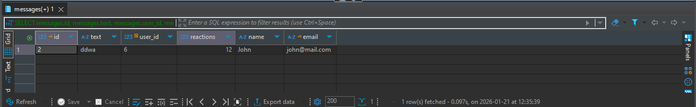
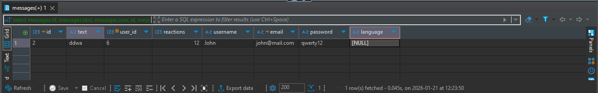

# PostgreSQL


## Insert data into table

```sql
1. INSERT INTO table_name(fields, ...)
2. VALUES ('ex1', 'ex2', ...);

```

2. To select information from the columns we need
```sql
1. SELECT name, email FROM user;
```

3. Select only the information that is greater or less than the parameter we need
```sql
1. SELECT * FROM user WHERE age > 16;
```
   

4. Sorting in order and vice versa
```sql
   - SELECT * FROM user ORDER BY age;
   - SELECT * FROM user ORDER BY age DESC;
```
    
5. Find data behind similar symbols
```sql
1. SELECT * FROM user WHERE user_name ilike 'artem'
```
6. Example with join
```sql
SELECT 
    messages.id,
    messages.text,
    messages.user_id,
    messages.reactions,
    user_1112121.name,
    user_1112121.email
FROM messages
LEFT JOIN user_1112121 
    ON messages.user_id = user_1112121.id;

   ```

```sql
SELECT
    messages.id, 
    messages.text, 
    messages.user_id, 
    messages.reactions, 
    user_1112121.name as username, 
    user_1112121.email, 
    user_1112121.password, 
    settings_1.language
from messages 
left join user_1112121 
    ON messages.user_id = user_1112121.id
left join settings_1
    ON messages.user_id = settings_1.user_id

```

   
7. Difference between left join and right join
> LEFT JOIN: Returns all rows from the left table and matches from the right table. If there are no matches, NULL values are placed on the right side.
> 
> RIGHT JOIN: Returns all rows from the right table and matches from the left table. If there are no matches, NULL values are placed on the left side. 

